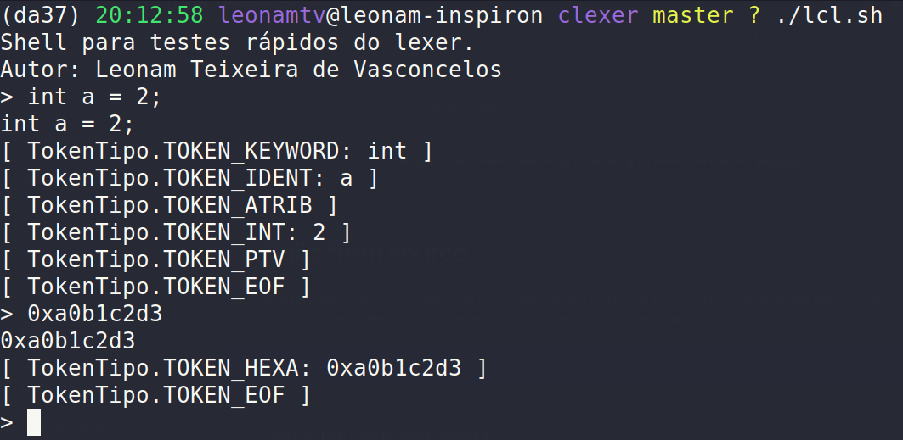
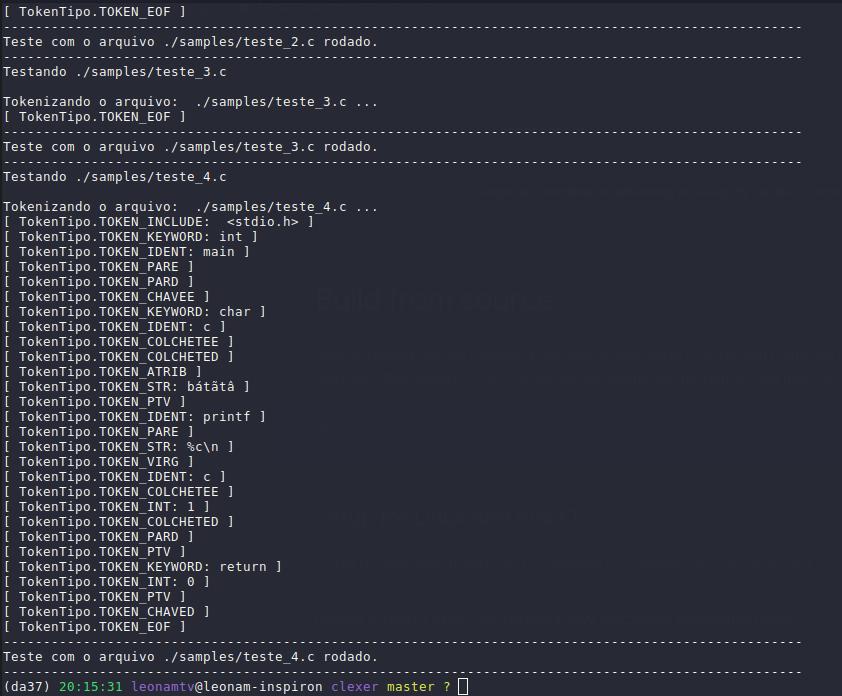
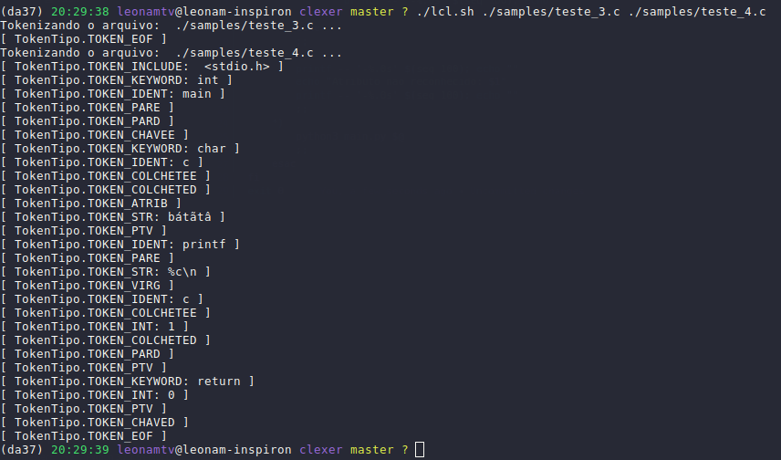

# LCL - Leonam C Lexer

Lexer para a linguagem ANSI-C da matéria de compiladores na turma de engenharia de computação CEFET-MG.

## Como executar

Dê permissão de execução ao script `lcl.sh` com `chmod +x lcl.sh`. 

Caso queira rodar um shell interativo, digite:

```
./lcl.sh
```

<p align='center'>
    
</p>


Caso queira rodar o lexer com os arquivos de teste, digite:

```
./lcl.sh --test
```

<p align='center'>
    
</p>

Caso queira rodar o lexer com outro(s) arquivo(s), digite:

```
./lcl.sh <caminho do arquivo 1> <caminho do arquivo 2> ... 
```

<p align='center'>
    
</p>